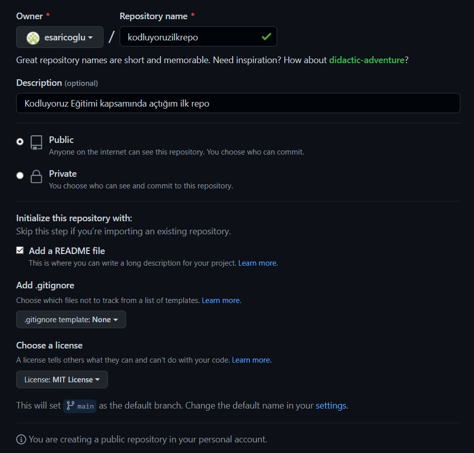

# Kodluyoruz Ilk Repo
***
Bu repo [Kodluyoruz](https://kodluyoruz.org/kodluyoruz) Front-End Eğitiminde oluşturduğumuz ilk repo. İçerisinde bir adet README dosyası, bir adet de index.html barındırıyor.

## Installation
Öncelikle projeyi clonelayın.

```bash
git clone https://github.com/esaricoglu/kodluyoruzilkrepo.git
```
## Usage

Projeyi cloneladıktan sonra visual Studio Code programında açınız.

Linux için:

```linux
cd kodluyoruzlkrepo
code .
```

# Contributing

Pull requestler kabul edilir. Büyük değişiklikler için, lütfen önce neyi değiştirmek istediğinizi tartışmak için bir konu açınız.

# License

[MIT](https://choosealicense.com/licenses/mit/)
